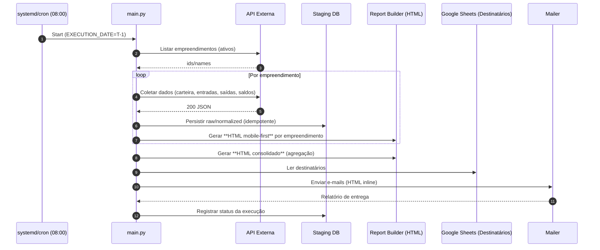

# Rascunho do escopo (a ser validado com a Abecker)

# Arquitetura de Software – Relatório Diário de Fluxo de Caixa

> Objetivo: Coletar dados de uma API diariamente em uma VM, processar conforme a arquitetura do relatório (entradas, saídas e saldos), gerar um relatório (HTML/PDF) inspirado no Portal do Investidor e enviar por e-mail a uma lista gerenciada em uma planilha do Google Sheets.

---

## 1) Visão Geral

- **Escopo diário em T-1**: todo processamento considera **sempre o dia anterior** (data de referência = T-1), independentemente da hora de execução.
- **Entrada**: rotas da API corporativa para carteira, recebimentos, saídas e saldos por **empreendimento**.
- **Processamento**: ETL + cálculos/agrupamentos de acordo com a *Arquitetura do Relatório de Fluxo de Caixa* (já definida em documento separado).
- **Saída**: **relatórios HTML** (mobile-first) — **um por empreendimento** + **um consolidado** — enviados por e-mail; não há persistência de HTML em storage.
- **Agendamento**: execução diária às **08:00 (America/Sao_Paulo)** com política de retry configurável.
- **Governança**: versionamento de schema, idempotência por data de referência (T-1) e auditoria de execuções.

---

## 2) Requisitos Funcionais

1. **Processar em T-1**: a data de referência é sempre o **dia anterior** à execução.
2. **Descoberta de empreendimentos**: coletar da API a lista de **empreendimentos ativos** e iterar gerando **um relatório HTML por empreendimento**.
3. **Relatório consolidado**: após concluir os individuais, gerar **um HTML consolidado** (agregando todos os empreendimentos).
4. **Dados necessários** (por empreendimento):
    - **Dados de Carteira** (VP, LTV, prazo médio, duration) para compor o cabeçalho de Recebimentos.
    - **Entradas de caixa**: previsto vs. realizado; composição (ativos, recuperações, antecipações, outras).
    - **Saídas de caixa**: orçado vs. realizado; categorias (OPEX, financeiras, CAPEX, distribuições).
    - **Saldos**: inicial/final e evolução mensal.
5. **Geração de HTML (mobile-first)** seguindo os blocos e componentes definidos na *Arquitetura do Relatório de Fluxo de Caixa*.
6. **Envio por e-mail**: ler a lista de destinatários em Google Sheets (range configurável) e enviar **o HTML inline** (sem anexo PDF; opcionalmente imagens embutidas/base64).
7. **Registro mínimo de execução**: armazenar metadados de runs e idempotência (sem especificar formato de logs).

---

## 3) Requisitos Não-Funcionais

- **Segurança**: Segredos via ambiente/vault; TLS nas chamadas; escopos mínimos nas APIs.
- **Observabilidade**: Métricas de execução e **alertas por e-mail** em falhas ou anomalias críticas.
- **Confiabilidade**: Retry com backoff; job reentrante/idempotente por data.
- **Portabilidade**: Docker + compose em VM Ubuntu LTS.
- **Disponibilidade de entrega**: envio garantido **todos os dias às 08:00**; sem SLA de tempo total de geração.

---

## 4) Componentes e Responsabilidades

### 4.1 Scheduler & Runner

- **Cron** ou **systemd timer** dispara um **wrapper** Python (`main.py`) com data de referência.
- Variáveis: `EXECUTION_DATE`, janelas de retry, timeout global.

### 4.2 Config & Secrets

- **.env** + suporte a **variáveis de ambiente** na VM.
- Integrações: API (OAuth2/Token), SMTP/Gmail API, Google Sheets (Service Account ou OAuth2), Storage (S3 opcional).
- **Config central** (YAML/JSON): endpoints, ranges do Sheets, templates, thresholds (alertas de saldo).

### 4.3 Ingestion Service

- Conexões HTTP robustas (timeout, retry, rate-limit aware).
- Mapeamento para **DTOs** (dataclasses) com validação (pydantic).
- **Staging DB** (SQLite/Postgres) para raw + normalized.
- **Idempotência**: chave composta (`source`, `exec_date`, `hash_payload`).

### 4.4 Transform & Metrics Engine

- Regras de negócio do relatório:
    - **Entradas**: previsto vs. realizado; origem (ativos, recuperações, antecipações, outras).
    - **Saídas**: orçado vs. realizado; categorias (OPEX, Financeiras, CAPEX, Distribuições).
    - **Saldo**: inicial + entradas - saídas = final; liquidez; BEP de caixa; projeções simples.
- **Versionamento de fórmula** e **tests** unitários para cada cálculo.

### 4.5 Report Builder (HTML)

- **HTML mobile-first** com CSS responsivo (grid/flex) e componentes reutilizáveis (cards, tabelas, gráficos).
- Seguir **estritamente** os blocos e hierarquia definidos na *Arquitetura do Relatório de Fluxo de Caixa* (documento referenciado).
- Gráficos renderizados em **Canvas (Chart.js)** incorporado ao HTML.
- **Somente HTML**: não gerar PDF; não salvar em storage.

### 4.6 Google Sheets Loader

- Leitura de **range** configurável: `A2:A` (e-mails válidos). Suporte a nome + e-mail.
- Sanitização: remover duplicados, normalizar domínios, validação RFC.

### 4.7 Mailer

- Suporte a **SMTP** ou **Gmail API**.
- Envio do **HTML inline** (mobile-first) com assunto parametrizado por projeto/data.
- Loteamento automático em caso de listas grandes.

### 4.8 (Removido)

- Não há armazenamento de artefatos (HTML) fora do envio por e-mail.
- Artifacts Store (opcional): Persistir HTML/PDF por data (`YYYY/MM/DD/report.html|pdf`) em S3/Blob; gerar link público temporário.

---

## 5) Modelo de Dados (sugestão)

### 5.1 Tabelas

- **`runs`**: id, `exec_date`, status, started_at, finished_at, error, metrics JSON.
- **`raw_payloads`**: id, source, exec_date, payload_json (gzip), hash.
- **`cash_in`**: id, empreendimento_id, ref_month, category, forecast, actual.
- **`cash_out`**: id, empreendimento_id, ref_month, category, budget, actual.
- **`balance`**: id, empreendimento_id, ref_month, opening, closing.
- **`portfolio_stats`**: id, empreendimento_id, ref_month, vp, ltv, prazo_medio, duration.

### 5.2 DTOs

- `PortfolioStats { empreendimento_id, vp, ltv, prazo_medio, duration }`
- `CashInItem { empreendimento_id, ref_month, category, forecast, actual }`
- `CashOutItem { empreendimento_id, ref_month, category, budget, actual }`
- `BalanceItem { empreendimento_id, ref_month, opening, closing }`

---

## 6) Contratos de API

Consulte a documentação oficial: [**https://dev.mega.com.br/apis/**](https://dev.mega.com.br/apis/)

> A integração deverá seguir os contratos, autenticação e limites definidos nessa documentação.

---

## 8) Templates do Relatório

Ver **Arquitetura do Relatório de Fluxo de Caixa** (documento previamente elaborado) para a composição de seções, componentes visuais e indicadores.

---

## 9) Entregas por E-mail

- **Assunto**: `Fluxo de Caixa – {EMPREENDIMENTO|CONSOLIDADO} – {AAAA-MM-DD (T-1)}`.
- **Corpo**: **HTML inline mobile-first** com resumo e blocos completos (sem anexo PDF).
- **Lista de destinatários**: obtida via Google Sheets (aba/range configurável). Deduplicação e validação de e-mails.

---

## 10) Operação e Observabilidade

- **Agendamento**: execução diária às **08:00** (America/Sao_Paulo), considerando T-1.
- **Retries**: em caso de falha de coleta/envio, tentar novamente com backoff exponencial configurável.
- **Alertas**: enviar **alertas por e-mail** quando ocorrerem falhas críticas (coleta, transformação, envio) ou ausência de execução.

---

## 11) Segurança

- **Segredos**: `.env` protegido + permissões 600; opcional Vault.
- **Transporte**: HTTPS obrigatório; verificação de certificado; retries seguros.
- **Acesso**: princípio de menor privilégio nas chaves Google e SMTP.
- **Dados**: evitar PII; mascarar e-mails em logs; criptografar artefatos se sensível.

---

## 12) Deployment & Infra

- **Stack**: Python 3.11+, Poetry, SQLAlchemy, Pydantic, Requests, Jinja2, Chart.js (embutido no HTML), Google API Python Client, SMTP/Gmail API.
- **Empacotamento**: Docker + docker-compose; volume para `db/` (staging) e `secrets/`.
- **VM**: Ubuntu 22.04 LTS; `systemd` service/timer para orquestrar a execução às 08:00.
- **Ambientes**: `dev` (dados mock) e `prod` (dados reais). Feature flags por ENV.

---

## 13) Estrutura de Pastas (exemplo)

```
repo/
  app/
    config/
      settings.py
    core/
      scheduler.py
      logging.py
      mailer.py
      sheets.py
      storage.py
    ingestion/
      client.py
      dto.py
      normalize.py
    domain/
      rules.py
      metrics.py
    persistence/
      db.py
      models.py
      runs.py
    reporting/
      templates/
        base.html
        sections/
          header.html
          entradas.html
          saidas.html
          saldo.html
          insights.html
      build.py
      pdf.py
    cli.py
    main.py
  tests/
  docker/
    Dockerfile
    compose.yml
  artifacts/
  db/
  .env.example
```

---

## 14) Sequência de Execução (exemplo)



---

## 15) Testes e Qualidade

- **Unitários**: regras de cálculo, normalização, render de templates.
- **Integração**: cliente da API (responses mock), Google Sheets, SMTP.
- **End-to-end**: execução completa em `dev` com dados sintéticos.
- **Golden files**: snapshots de HTML/PDF para regressão visual.

---

## 16) Runbook (Operacional)

1. **Configuração inicial**: preencher `.env`, provisionar credenciais de API/Google, subir serviços (`docker compose up -d`).
2. **Dry-run**: executar `python -m app.main --date YYYY-MM-DD` para validar coleta e renderização HTML.
3. **Falhas de coleta/envio**: verificar credenciais, conectividade e reprocessar via parâmetro `-retry`.
4. **Ajustes de layout**: atualizar templates HTML/CSS mantendo o padrão mobile-first.

---

## 17) Roadmap (Evoluções)

- **Links públicos** aos PDFs em storage + botão "Abrir no navegador".
- **Assinatura digital** do PDF (hash) e checksum salvo em DB.
- **Painel de saúde** (FastAPI) com status das últimas execuções.
- **Projeções de caixa** (ARIMA/Prophet leve) e cenários.
- **Multitenant** por projeto/empreendimento.

---

### Checklist de Configuração (.env exemplo)

```
API_BASE_URL=https://api.exemplo.com
API_TOKEN=xxxxx
SMTP_HOST=smtp.exemplo.com
SMTP_PORT=587
SMTP_USER=relatorios@exemplo.com
SMTP_PASS=******
SENDER_NAME="Relatórios Starke"
SENDER_EMAIL=relatorios@exemplo.com
GCP_SERVICE_ACCOUNT_JSON=/secrets/sa.json
GSH_SHEET_ID=xxxxxxx
GSH_RANGE=mailing!A2:B
REPORT_TIMEZONE=America/Sao_Paulo
RUN_AT=05:30
ARTIFACTS_DIR=/data/artifacts
DB_URL=sqlite:////data/db/app.db
```

---

# Arquitetura Revisada do Relatório de Fluxo de Caixa

## 1. Cabeçalho e Contexto

- **Título**: Fluxo de Caixa Consolidado
- **Empreendimento:** Nome do empreendimento ou indicativo de relatorio consolidado
- **Filtros**: Período (mensal, trimestral, anual).
- **Resumo Rápido (cards)**:
    - Entradas totais
    - Saídas totais
    - Saldo final
    - Variação do saldo

---

## 2. Entradas de Caixa (Recebimentos)

### 2.1 Dados Gerais de Carteira *(novo bloco antes da análise)*

Inspirado no exemplo do Portal do Investidor:

- **VP da Carteira (Valor Presente)**
- **LTV médio da carteira**
- **Prazo médio dos contratos**
- **Duration média**
- (Opcional) Outros dados estáticos da carteira que ajudam a contextualizar o caixa (ex.: % contratos ativos, % liquidados).

> Esses indicadores aparecem em destaque no topo da seção, em cards pequenos.

---

### 2.2 Análise de Recebimentos

- **Totais e Variação**: Previsto vs Realizado.
- **Breakdown de origens**:
    - Recebimentos de contratos ativos
    - Recuperação de parcelas vencidas
    - Antecipações
    - Outras entradas (aportes etc.)
- **Visualização**:
    - Linha histórica de recebimentos (12 meses).
    - Gráfico de pizza/barras para proporção de origens.

---

## 3. Saídas de Caixa (Pagamentos)

- **Totais e variação**: Orçado vs Realizado.
- **Breakdown de saídas**:
    - Custos operacionais
    - Despesas financeiras
    - Investimentos (CAPEX)
    - Distribuições (dividendos, retiradas)
- **Visualização**:
    - Barras empilhadas por categoria.
    - Linha histórica mensal.

---

## 4. Análise de Saldo de Caixa

- **Cálculo**: Saldo inicial + Entradas - Saídas = Saldo final.
- **Indicadores**:
    - Liquidez imediata (quantos meses cobertos)
    - Ponto de equilíbrio de caixa
- **Visualização**:
    - Gráfico de área/linha acumulada.
    - Destaque para meses negativos.

---

## 5. Insights Analíticos

- Principais destaques de entradas, saídas e saldo.
- Alertas (ex.: caixa negativo previsto).
- Recomendações gerenciais.

> **Nota:** Esta é uma sessão que pode ser acrescentada futuramente. Nela, podemos utilizar IA para apresentar analises preditivas e realizar recomendações relacionadas ao estado atual dos dados.

---

# Documentação de Cálculos – Relatório de Fluxo de Caixa

## 1. Cabeçalho e Contexto

- **Entradas totais (R$)**

    Soma de todas as entradas do período selecionado (contratos ativos + recuperações + antecipações + outras entradas).

- **Saídas totais (R$)**

    Soma de todas as saídas do período (custos operacionais + despesas financeiras + CAPEX + distribuições).

- **Saldo final (R$)**

    ```
    Saldo Final = Saldo Inicial + Entradas Totais - Saídas Totais
    ```

- **Variação do saldo (%)**

    ```
    Var. Saldo = ((Saldo Final - Saldo Inicial) / Saldo Inicial) × 100
    ```

    Obs.: Se Saldo Inicial = 0, reportar apenas o valor absoluto.

---

## 2. Entradas de Caixa (Recebimentos)

### 2.1 Dados Gerais de Carteira

- **VP da Carteira (Valor Presente)**

    Valor presente líquido da carteira de contratos, obtido da API.

- **LTV médio da carteira**

    Média do valor total de receita esperada por contrato.

    ```
    LTV Médio = (Σ LTV dos Contratos) / Nº de Contratos
    ```

- **Prazo médio dos contratos (meses)**

    Média ponderada da duração dos contratos ativos.

- **Duration média (meses)**

    Indicador de risco, calculado conforme regra financeira do emissor (retornar direto da API, se disponível).

---

### 2.2 Análise de Recebimentos

- **Totais Previsto vs Realizado**

    Comparar o somatório previsto pela API (forecast) com o realizado no período.

    ```
    Var. Recebimentos = ((Realizado - Previsto) / Previsto) × 100
    ```

- **Breakdown de origens**
    - **Contratos ativos** = recebimentos de parcelas regulares.
    - **Recuperação de parcelas vencidas** = recebimentos de inadimplência regularizada.
    - **Antecipações** = recebimentos adiantados.
    - **Outras entradas** = aportes, dividendos, etc.

    Cada item é calculado como soma dos valores realizados no período.

---

## 3. Saídas de Caixa (Pagamentos)

- **Totais Orçado vs Realizado**

    Comparar orçamento da API com o realizado.

    ```
    Var. Saídas = ((Realizado - Orçado) / Orçado) × 100
    ```

- **Breakdown de categorias**
    - **Custos operacionais (OPEX)** = despesas fixas e variáveis da operação.
    - **Despesas financeiras** = juros, amortizações, tarifas bancárias.
    - **Investimentos (CAPEX)** = saídas ligadas a aquisição de ativos, obras ou tecnologia.
    - **Distribuições** = dividendos, retiradas de sócios, participações.

    Cada categoria é a soma dos valores realizados informados pela API.

---

## 4. Análise de Saldo de Caixa

- **Saldo inicial (R$)**

    Valor de caixa disponível no início do período.

- **Saldo final (R$)**

    Já definido acima:

    ```
    Saldo Final = Saldo Inicial + Entradas Totais - Saídas Totais
    ```

- **Liquidez imediata (meses)**

    Mede quantos meses de custos fixos podem ser cobertos com o saldo final.

    ```
    Liquidez = Saldo Final / Custos Fixos Médios Mensais
    ```

- **Ponto de equilíbrio de caixa (BEP)**

    Se:

    ```
    Entradas Totais ≥ Saídas Totais  ⟹  Caixa Equilibrado
    ```

    Caso contrário, alerta de déficit.
