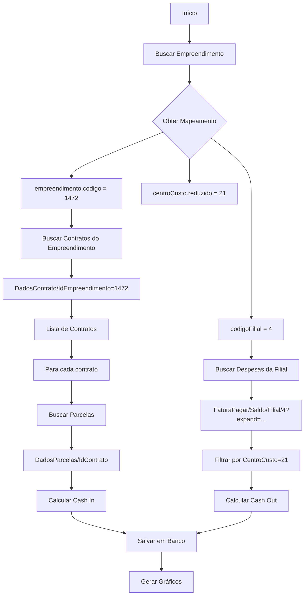

# Rotas da API Mega para Construção dos Gráficos

**Data:** 30 de Outubro de 2025
**Projeto:** Starke - Sistema de Relatórios de Fluxo de Caixa
**API:** Mega ERP v1.x

---

## 📊 Sumário de Gráficos

O sistema Starke possui **4 gráficos principais** no dashboard:

1. **Evolution Chart** - Evolução de Entradas vs Saídas (12 meses)
2. **Cash In Distribution** - Distribuição de Entradas por Categoria
3. **Cash Out Comparison** - Comparação Orçado vs Realizado por Categoria
4. **Balance Evolution** - Evolução do Saldo de Caixa

---

## 🗂️ Estrutura de Dados por Gráfico

### 1. Evolution Chart (Entradas vs Saídas - 12 meses)

**Dados Necessários:**
- Entradas mensais (últimos 12 meses)
- Saídas mensais (últimos 12 meses)
- Filtrado por empreendimento

**Endpoint Utilizado:**
```
GET /api/web/reports/evolution-data?development_id={id}
```

**Observação:** Este é um endpoint interno do Starke que agrega dados de:
- CashIn (entradas) - tabela `cash_in`
- CashOut (saídas) - tabela `cash_out`

---

### 2. Cash In Distribution (Distribuição de Entradas)

**Dados Necessários:**
- Entradas realizadas por categoria:
  - Contratos Ativos
  - Recuperações
  - Antecipações
  - Outras Entradas

**Rotas da API Mega Utilizadas:**

#### 2.1. Buscar Contratos do Empreendimento

```http
GET /api/Carteira/DadosContrato/IdEmpreendimento={empreendimento_id}
```

**Response Schema:**
```json
[
  {
    "cod_contrato": 2547,
    "nome_cliente": "Ana Maria",
    "cpf_cnpj_cliente": "111.111.111-11",
    "valor_contrato": 428982.78,
    "status_contrato": "Ativo",
    "cod_empreendimento": 3574,
    "nome_empreendimento": "Senior Square I"
  }
]
```

**Campos Utilizados:**
- `cod_contrato` - Para buscar parcelas
- `cod_empreendimento` - Para filtrar
- `status_contrato` - Para filtrar contratos ativos

---

#### 2.2. Buscar Parcelas de Cada Contrato

```http
GET /api/Carteira/DadosParcelas/IdContrato={contrato_id}
```

**Response Schema:**
```json
[
  {
    "cod_contrato": 2547,
    "cod_parcela": 547821,
    "status_parcela": "Ativo",
    "tipo_parcela": "Mensal",
    "sequencia": "001/020",
    "data_vencimento": "10/11/2023",
    "data_baixa": "10/11/2023",
    "vlr_original": 2000.00,
    "vlr_corrigido": 2154.87,
    "vlr_pago": 2154.87,
    "situacao": "Pago",
    "parcela_processo": "Contrato",
    "parcela_origem": "Contrato",
    "vlr_jurosreneg": 0.00,
    "receita_pgto": "Bloqueto Bancario"
  }
]
```

**Campos Críticos Utilizados:**

| Campo | Uso | Exemplo |
|-------|-----|---------|
| `status_parcela` | Filtrar apenas "Ativo" | "Ativo" |
| `tipo_parcela` | Categorizar (antecipação, renegociação) | "Mensal", "Antecipação" |
| `data_vencimento` | Calcular forecast (previsto) | "10/11/2023" |
| `data_baixa` | Calcular actual (realizado) | "10/11/2023" |
| `vlr_original` | Valor previsto | 2000.00 |
| `vlr_pago` | Valor efetivamente pago | 2154.87 |
| `situacao` | Status de pagamento | "Pago", "Aberto" |
| `parcela_processo` | Identificar renegociações | "Renegociação" |
| `parcela_origem` | Origem da parcela | "Renegociação", "Contrato" |

**Regras de Categorização:**

```python
# FORECAST (Previsto)
if data_vencimento.month == ref_month:
    if "antecip" in tipo_parcela.lower():
        categoria = "ANTECIPACOES"
    elif "reneg" in tipo_parcela.lower() or parcela_processo == "Renegociação":
        categoria = "RECUPERACOES"
    else:
        categoria = "ATIVOS"
    forecast += vlr_original

# ACTUAL (Realizado)
if data_baixa.month == ref_month and situacao in ("Pago", "Liquidado"):
    if data_baixa < data_vencimento:
        categoria = "ANTECIPACOES"  # Pagou antes do vencimento
    elif data_vencimento.month != data_baixa.month:
        categoria = "RECUPERACOES"  # Pagou em mês diferente do vencimento
    else:
        categoria = "ATIVOS"  # Pagou no mês correto
    actual += vlr_pago
```

**Implementação:**
- Arquivo: `src/starke/domain/services/cash_flow_service.py`
- Método: `calculate_cash_in_from_parcelas()`
- Linhas: 37-185

---

### 3. Cash Out Comparison (Saídas: Orçado vs Realizado)

**Dados Necessários:**
- Saídas orçadas e realizadas por categoria:
  - OPEX (Custos Operacionais)
  - Despesas Financeiras
  - CAPEX (Investimentos)
  - Distribuições

**Rotas da API Mega Utilizadas:**

#### 3.1. Buscar Empreendimentos e Mapeamento

```http
GET /api/globalestruturas/Empreendimentos
```

**Response Schema:**
```json
[
  {
    "codigo": 1472,
    "nome": "CONDOMINIO DONA MARIA (ARAQUARI)",
    "codigoFilial": 4.0,
    "centroCusto": {
      "reduzido": 21,
      "identificador": "1"
    },
    "projeto": {
      "reduzido": 5001
    }
  }
]
```

**Campos Utilizados:**
- `codigo` - ID do empreendimento
- `codigoFilial` - Para buscar despesas da filial
- `centroCusto.reduzido` - **CHAVE** para filtrar despesas do empreendimento

**Mapeamento Crítico:**
```
Empreendimento 1472 → Centro de Custo 21 → Filial 4
```

---

#### 3.2. Buscar Despesas por Filial

**⚠️ ATENÇÃO:** Esta chamada retorna despesas de TODOS os empreendimentos da filial!

```http
GET /api/FinanceiroMovimentacao/FaturaPagar/Saldo/Filial/{filial_id}/{data_inicio}/{data_fim}
    ?expand=classeFinanceira,centroCusto,projeto
```

**Exemplo:**
```http
GET /api/FinanceiroMovimentacao/FaturaPagar/Saldo/Filial/4/2025-10-01/2025-10-31
    ?expand=classeFinanceira,centroCusto,projeto
```

**Response Schema (SEM expand - NÃO USE!):**
```json
{
  "Filial": {"Id": 4},
  "Agente": {"Codigo": 6371},
  "NumeroAP": 31864,
  "TipoDocumento": "CONTPG",
  "DataVencimento": "25/10/2025",
  "ValorParcela": 50000.0,
  "SaldoAtual": 50000.0
}
```

**Response Schema (COM expand - USE ESTE!):**
```json
{
  "Filial": {"Id": 4},
  "Agente": {
    "Codigo": 6371,
    "Nome": "Fornecedor ABC"
  },
  "NumeroAP": 31864,
  "TipoDocumento": "CONTPG",
  "DataVencimento": "25/10/2025",
  "ValorParcela": 50000.0,
  "SaldoAtual": 0.0,

  // ⭐ Campos adicionados pelo expand
  "ClasseFinanceira": {
    "Identificador": "1.2.03",
    "Descricao": "DESPESAS OPERACIONAIS"
  },
  "CentroCusto": {
    "Reduzido": 21,
    "Identificador": "EMP-001",
    "Descricao": "Empreendimento XYZ"
  },
  "Projeto": {
    "Reduzido": 5001,
    "Descricao": "Projeto ABC"
  }
}
```

**Campos Críticos Utilizados:**

| Campo | Uso | Exemplo |
|-------|-----|---------|
| `CentroCusto.Reduzido` | **Filtrar por empreendimento** | 21 |
| `ClasseFinanceira.Identificador` | **Categorizar despesas** | "1.2.03" |
| `DataVencimento` | Calcular orçado (budget) | "25/10/2025" |
| `ValorParcela` | Valor orçado | 50000.0 |
| `SaldoAtual` | Identificar se foi pago (0 = pago) | 0.0 |

**Regras de Cálculo:**

```python
# BUDGET (Orçado)
if data_vencimento.month == ref_month:
    categoria = mapear_categoria(classe_financeira.Identificador)
    budget += valor_parcela

# ACTUAL (Realizado)
if data_vencimento.month == ref_month and saldo_atual == 0:
    categoria = mapear_categoria(classe_financeira.Identificador)
    actual += valor_parcela  # Se saldo = 0, foi pago integralmente
```

**Mapeamento de Categorias via Classe Financeira:**

```python
# src/starke/domain/services/classe_financeira_mapper.py

CATEGORY_MAPPING = {
    CashOutCategory.OPEX: [
        "1.2.01",  # Salários e Encargos
        "1.2.02",  # Manutenção
        "1.2.03",  # Utilities (água, luz, etc)
        "1.2.04",  # Marketing
        # ... outros códigos OPEX
    ],
    CashOutCategory.CAPEX: [
        "1.1.01",  # Construção Civil
        "1.1.02",  # Equipamentos
        "1.1.03",  # Melhorias
        # ... outros códigos CAPEX
    ],
    CashOutCategory.FINANCEIRAS: [
        "1.3.01",  # Juros
        "1.3.02",  # Taxas Bancárias
        "1.3.03",  # IOF
        # ... outros códigos Financeiras
    ],
    CashOutCategory.DISTRIBUICOES: [
        "1.4.01",  # Dividendos
        "1.4.02",  # Lucros Distribuídos
        # ... outros códigos Distribuições
    ]
}
```

**⚠️ IMPORTANTE:** Os códigos de classe financeira variam por instalação do Mega!

**Implementação:**
- Arquivo: `src/starke/domain/services/cash_flow_service.py`
- Método: `calculate_cash_out_from_despesas()`
- Linhas: 212-325

---

### 4. Balance Evolution (Evolução do Saldo)

**Dados Necessários:**
- Saldo de abertura mensal
- Saldo de fechamento mensal
- Filtrado por empreendimento

**Endpoint Utilizado:**
```
GET /api/web/reports/evolution-data?development_id={id}
```

**Cálculo:**
```python
saldo_fechamento = saldo_abertura + entradas - saídas
```

**Dados Agregados de:**
- Tabela `balance` (saldos calculados)
- Calculado a partir de CashIn e CashOut

**Implementação:**
- Arquivo: `src/starke/domain/services/cash_flow_service.py`
- Método: `calculate_balance()`
- Linhas: 403-462

---

## 🔄 Fluxo Completo de Coleta de Dados

### Para um Empreendimento Específico:



---

## 📋 Checklist de Chamadas por Período

Para processar **1 mês** de **1 empreendimento**:

| Passo | Rota | Quantidade | Dados Obtidos |
|-------|------|------------|---------------|
| 1 | `/api/globalestruturas/Empreendimentos` | 1x | Mapeamento empreendimento ↔ centro custo |
| 2 | `/api/Carteira/DadosContrato/IdEmpreendimento={id}` | 1x | Lista de contratos (ex: 50 contratos) |
| 3 | `/api/Carteira/DadosParcelas/IdContrato={id}` | 50x | Parcelas de cada contrato |
| 4 | `/api/FinanceiroMovimentacao/FaturaPagar/Saldo/Filial/{filial}/{inicio}/{fim}?expand=...` | 1x | Todas despesas da filial |

**Total:** ~52 requests para 1 empreendimento/mês

**Para 12 meses:** ~52 requests (porque FaturaPagar já traz período completo)

---

## 🚀 Otimizações Implementadas

### 1. Uso de Período Completo em FaturaPagar

**Antes (lento):**
```python
# 12 requests separados
for mes in range(1, 13):
    despesas = api.get_despesas_by_filial(filial, f"2024-{mes:02d}-01", f"2024-{mes:02d}-31")
```

**Depois (rápido):**
```python
# 1 request único
despesas = api.get_despesas_by_filial(filial, "2024-01-01", "2024-12-31")
# Agregar por mês no código
```

---

### 2. Uso de expand para Evitar Requests Extras

**Sempre usar:**
```
?expand=classeFinanceira,centroCusto,projeto
```

**Vantagem:** Evita ter que fazer chamadas adicionais para buscar:
- Classe Financeira (categorização)
- Centro de Custo (filtro por empreendimento)
- Projeto (análise extra)

---

## ⚠️ Pontos de Atenção

### 1. Filial ≠ Empreendimento

```
FILIAL (empresa)
  └── EMPREENDIMENTO 1 (centro custo 21)
  └── EMPREENDIMENTO 2 (centro custo 22)
  └── EMPREENDIMENTO 3 (centro custo 23)
```

**Sempre filtrar por Centro de Custo após buscar despesas da Filial!**

---

### 2. Classe Financeira é Configurável

Os códigos de classe financeira variam por instalação do Mega.

**Antes de usar em produção:**
1. Consultar plano de contas da instalação
2. Mapear códigos para categorias
3. Documentar em `classe_financeira_mapper.py`

---

### 3. Parcelas Renegociadas já vêm em DadosParcelas

**NÃO é necessário** chamar endpoints separados:
- ❌ `DadosParcelasReneg`
- ❌ `DadosRenegociacoes`

**Motivo:** `DadosParcelas` já contém:
- `parcela_processo` = "Renegociação"
- `parcela_origem` = "Renegociação"
- `vlr_jurosreneg` = valor de juros

---

## 📊 Volumes Esperados

### Ambiente de Produção Típico:

| Métrica | Quantidade Estimada |
|---------|---------------------|
| Empreendimentos | 10-50 |
| Contratos por Empreendimento | 50-200 |
| Parcelas por Contrato | 20-120 |
| Despesas por Filial/Mês | 100-2000 |

### Tempo de Processamento:

| Operação | Tempo Estimado |
|----------|----------------|
| 1 Empreendimento/1 Mês | 30-60 segundos |
| 1 Empreendimento/12 Meses | 2-5 minutos |
| 10 Empreendimentos/12 Meses | 20-50 minutos |

---

## 🔗 Arquivos Relacionados

| Arquivo | Descrição |
|---------|-----------|
| `src/starke/infrastructure/external_apis/mega_client.py` | Cliente da API Mega |
| `src/starke/domain/services/cash_flow_service.py` | Serviço de cálculo de fluxo de caixa |
| `src/starke/domain/services/classe_financeira_mapper.py` | Mapeamento de classes financeiras |
| `docs/mapeamento-api-mega.md` | Documentação detalhada de mapeamento |
| `docs/swagger/mega/` | Especificações Swagger das APIs |

---

## 📝 Exemplos de Requests

### Autenticação

```http
POST /api/Auth/SignIn
Headers:
  tenantId: {tenant_id}
  grantType: Api
Body:
{
  "userName": "usuario",
  "password": "senha"
}

Response:
{
  "accessToken": "eyJhbGc...",
  "refreshToken": "def50200...",
  "expirationToken": "2025-10-30T15:30:00.000Z"
}
```

### Buscar Contratos

```http
GET /api/Carteira/DadosContrato/IdEmpreendimento=1472
Headers:
  Authorization: Bearer {accessToken}

Response: Array de contratos
```

### Buscar Parcelas

```http
GET /api/Carteira/DadosParcelas/IdContrato=2547
Headers:
  Authorization: Bearer {accessToken}

Response: Array de parcelas
```

### Buscar Despesas

```http
GET /api/FinanceiroMovimentacao/FaturaPagar/Saldo/Filial/4/2025-10-01/2025-10-31
    ?expand=classeFinanceira,centroCusto,projeto
Headers:
  Authorization: Bearer {accessToken}

Response: Array de despesas com expand
```

---

## 🎯 Próximos Passos

### Implementações Futuras:

1. **Rota de Período para Entradas:**
   - Testar `FaturaReceber/Saldo` com expand
   - Validar se tem DataBaixa e outros campos necessários
   - Se completa, usar para otimização

2. **Cache de Empreendimentos:**
   - Dados de empreendimentos mudam pouco
   - Implementar cache de 1 hora

3. **Processamento Paralelo:**
   - Processar múltiplos empreendimentos em paralelo
   - Usar asyncio ou threading

4. **Monitoramento:**
   - Logs de tempo de resposta por endpoint
   - Alertas para timeouts ou erros

---

**Última Atualização:** 30 de Outubro de 2025
**Autor:** Claude Code
**Versão da API Mega:** 1.x (Estruturas: 1.3.3.0, Recebíveis: 1.4.19.0, Financeiro: 1.2.0.0)
